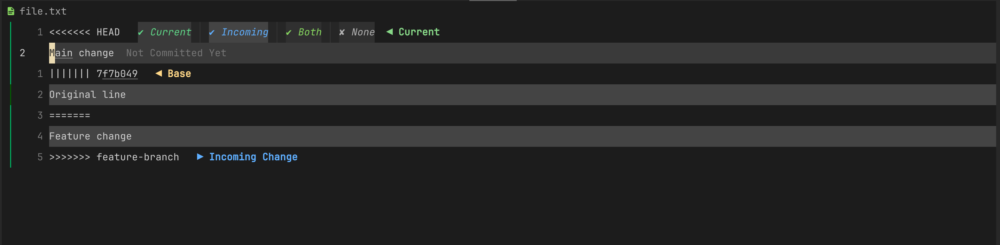
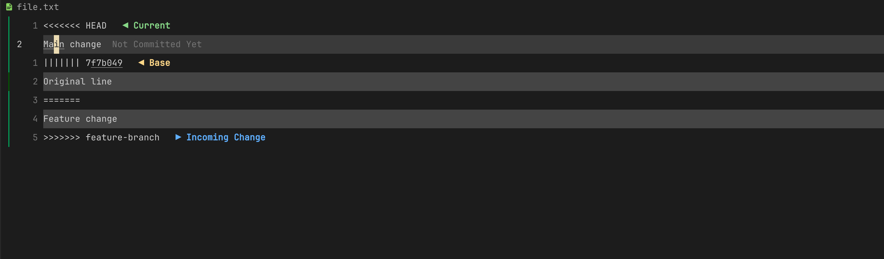
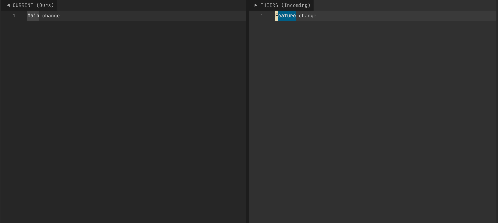
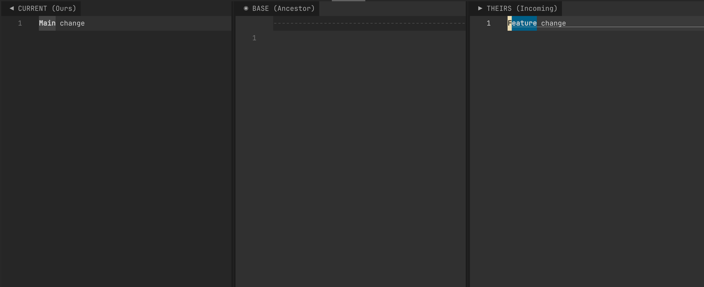

# conflict.nvim

Fast, smart Git conflict resolver for Neovim

## Features

- **Color-blended highlighting** — adapts to your colorscheme
- **Works everywhere** — git merge, AI-generated, manually pasted markers
- **Project listing** — `<leader>cl` lists all conflicts across project
- **User events** — `ConflictDetected`, `ConflictResolved` for automation
- **2-way/3-way diffs** — with diffview.nvim integration
- **Mouse-clickable actions** — optional action bar on markers
- **LSP auto-disabled** — suppressed during merge, re-enabled after


## Demo

### Markers like VSCode


### No markers


### 2-way


### 3-way



## Install

```lua
{
  "nxhung2304/conflict.nvim",
  config = function()
    require("conflict").setup()
  end,
}
```

Optional: `diffview.nvim`

## Config

```lua
require("conflict").setup({
  keymaps = { leader = "<leader>" },
  ui = { markers = false },           -- clickable action buttons
  detect = { anywhere = true },       -- detect outside git merge
  colors = {
    current  = "#56CC7A",
    incoming = "#40A6FF",
    base     = "#FFCC66",
  },
})
```

## Keymaps

| Key | Action |
|-----|--------|
| `<leader>ca` | Accept Current |
| `<leader>ci` | Accept Incoming |
| `<leader>cb` | Accept Both |
| `<leader>c0` | Accept None |
| `<leader>cn` | Next conflict |
| `<leader>cp` | Previous conflict |
| `<leader>c2` | 2-way diff |
| `<leader>c3` | 3-way diff |
| `<leader>cl` | List conflicts |

## Commands

```vim
:Conflict list     " List all project conflicts
:Conflict next     " Jump to next
:Conflict prev     " Jump to previous
```

## Events

```lua
vim.api.nvim_create_autocmd("User", {
  pattern = "ConflictDetected",
  callback = function(data) print("Conflict in buffer " .. data.bufnr) end,
})
```

## Statusline Integration

```lua
-- Get conflict count in current buffer
require("conflict").get_conflict_count()
